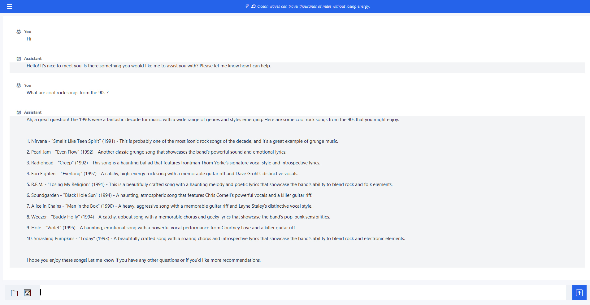
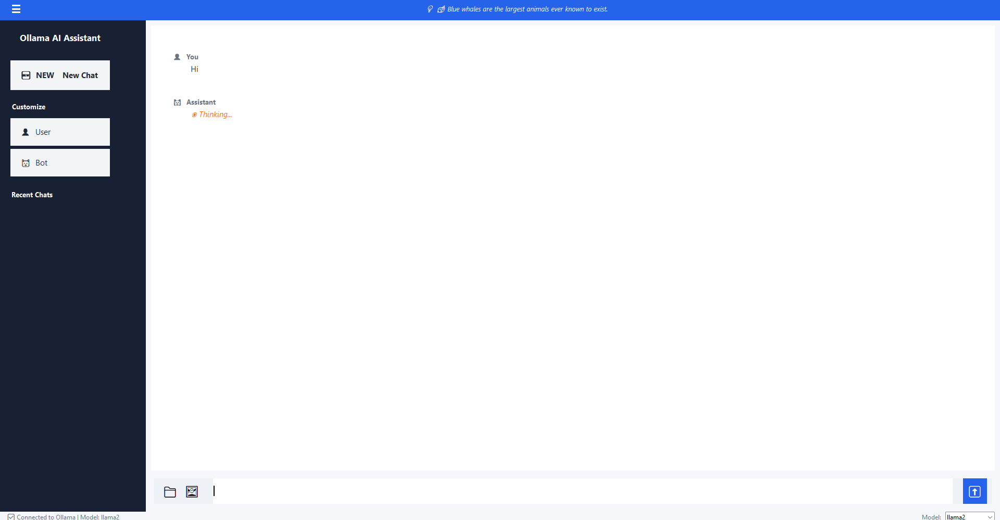
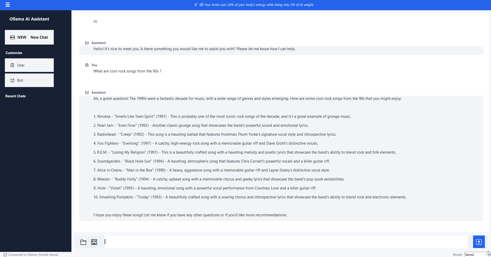
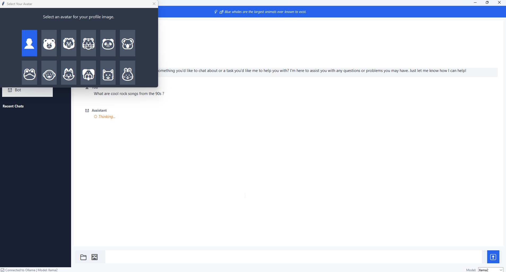
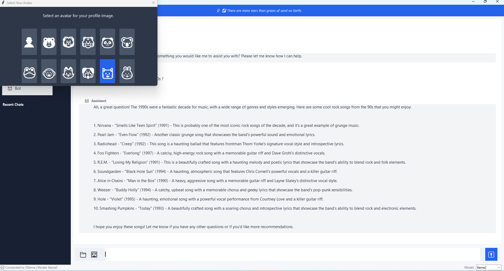

# 🤖 Ollama AI Assistant - Version 3.2

**ChatGPT-Inspired Desktop Chatbot with Multiple Chat Sessions**


---

## 🌟 What's New in v3.2?

### Major Features:

#### 💬 **Multiple Chat Sessions**
- Create and manage multiple independent chat conversations
- Switch between chats instantly from the sidebar
- Each chat has its own history and context
- Persistent storage - all chats saved automatically

#### 🎨 **Beautiful Blue UI Theme**
- Modern ChatGPT-inspired interface
- Clean, professional design with blue accents
- Sidebar navigation for easy chat management
- Enhanced bubble design for messages

#### 📜 **Chat History Management**
- All conversations saved automatically
- Resume previous chats anytime
- Chat list in sidebar shows recent sessions
- Persistent storage using pickle format

#### 💡 **Fun Facts Ticker**
- Educational facts displayed at the top
- Rotating trivia about science, nature, and more
- Updates automatically every 6 seconds

#### 📎 **File & Image Support** (from v2.0)
- Upload and analyze text files
- Upload and analyze images with vision models
- Support for code review, document analysis, OCR

#### 🌍 **Cross-Platform Compatible**
- Works seamlessly on **macOS**, **Windows**, and **Linux**
- Identical user experience across all platforms
- Standard tkinter implementation (no platform-specific code)
- See [Documentation/CROSS_PLATFORM.md](Documentation/CROSS_PLATFORM.md) for details

---

## 📸 Screenshots

### Main Chat Interface with Fun Facts Ticker

*The main chat interface showing a conversation with the AI. Features the **fun facts ticker** at the top displaying rotating trivia, clean message bubbles for user and assistant, and **file/image attachment buttons** at the bottom for uploading content.*

### Sidebar with Chat Management

*The **collapsible sidebar** featuring the "Ollama AI Assistant" header, **NEW Chat button** for creating new conversations, **Customize section** with User and Bot avatar buttons, and the **Recent Chats** list for easy navigation between conversations. The "Thinking..." indicator shows the AI is processing.*

### Complete Conversation View

*A complete conversation demonstrating **multi-turn chat capability** with persistent history. The sidebar shows the full chat management interface, while the main area displays a detailed conversation about 90s rock songs, showcasing the AI's ability to provide comprehensive, formatted responses.*

### Avatar Customization Dialog

*The **avatar customization feature** allowing users to personalize their profile with various emoji characters (animals, faces, etc.). The dialog shows a grid of available avatars with the current selection highlighted. The status bar at the bottom displays the **model selector** (llama2) and connection status.*

### Avatar Selection with Highlight

*Close-up of the avatar selection dialog showing the selected avatar **highlighted in blue**. Users can choose from 12 different emoji avatars to customize both their own profile and the bot's avatar, making the chat experience more personal and engaging.*

### Upload Image

*Analyzing an uploaded image. The user attaches an image, and the AI automatically generates a detailed description of its contents. This feature supports visual understanding tasks such as object recognition, scene analysis, and content explanation, enhancing multimodal interactions within the chat.*

---

## 🚀 Quick Start

### Installation

```bash
# 1. Install Python 3.8+ if not already installed

# 2. Install dependencies
pip install requests

# 3. Install and start Ollama
# Visit: https://ollama.ai/download

# 4. Download a model
ollama pull llama2

# 5. Start Ollama service
ollama serve

# 6. Run the chatbot
python chatbot_v3.py
```

That's it! The application will launch with a beautiful blue interface.

---

## 📖 How to Use

### Creating Chats

1. **New Chat**: Click the "🆕 New Chat" button in the sidebar
2. **Switch Chats**: Click any chat in the sidebar to switch to it
3. **Auto-Save**: All chats are automatically saved

### Sending Messages

1. Type your message in the input box at the bottom
2. Click the ➡️ button or press `Enter` to send
3. View responses in the chat area

### Uploading Files

1. Click the 📁 icon to attach text files
2. Click the 🖼️ icon to attach images
3. Type your question about the file/image
4. Send the message

### Understanding the Interface

**Top Bar**:
- Displays rotating fun facts about science, nature, and more

**Sidebar** (Left):
- "🆕 New Chat" button to create new conversations
- List of all your chat sessions
- Click any chat to switch to it

**Main Area** (Center):
- Chat display showing conversation history
- Message bubbles for you and the AI
- Smooth scrolling

**Input Area** (Bottom):
- 📁 File attachment button
- 🖼️ Image attachment button
- Text input field
- ➡️ Send button

**Status Bar** (Very Bottom):
- Connection status to Ollama
- Current model being used

---

## 🎯 Version Comparison

| Feature | v1.0 | v2.0 | v3.2 |
|---------|:----:|:----:|:----:|
| Text Chat | ✅ | ✅ | ✅ |
| Multiple Models | ✅ | ✅ | ✅ |
| File Upload | ❌ | ✅ | ✅ |
| Image Upload | ❌ | ✅ | ✅ |
| **Multiple Chat Sessions** | ❌ | ❌ | ✅ |
| **Chat History Persistence** | ❌ | ❌ | ✅ |
| **Sidebar Navigation** | ❌ | ❌ | ✅ |
| **Blue Theme UI** | ❌ | ❌ | ✅ |
| **Fun Facts Ticker** | ❌ | ❌ | ✅ |
| Window Size | 1000x700 | 1200x800 | 1400x900 |

---

## ✨ Key Features

### Chat Management
- **Multiple Sessions**: Create unlimited chat conversations
- **Auto-Save**: Every message is saved automatically
- **Quick Switch**: Click any chat in sidebar to switch
- **Persistent**: Chats survive app restarts
- **Organized**: Each chat has unique ID and timestamp

### Modern Interface
- **ChatGPT-Inspired**: Familiar, intuitive design
- **Blue Theme**: Professional, eye-friendly colors
- **Responsive**: Smooth animations and interactions
- **Status Indicators**: Always know connection status
- **Fun Facts**: Learn while you chat

### AI Capabilities
- **Text Conversation**: Natural dialogue with AI
- **Code Review**: Upload code files for analysis
- **Document Analysis**: Process text documents
- **Image Understanding**: Analyze images with vision models
- **OCR**: Extract text from images
- **Multiple Models**: Choose from llama2, mistral, codellama, llava, and more

---

## 💻 System Requirements

- **Python**: 3.8 or higher
- **RAM**: 8GB minimum (16GB for vision models)
- **Storage**: 10GB free space (for AI models)
- **OS**: Windows, macOS, or Linux
- **Ollama**: Latest version installed
- **Dependencies**: requests library

---

## 🎨 Interface Colors

The new blue theme uses:
- **Background**: Light gray-blue (#f6f8fb)
- **Chat Background**: White (#ffffff)
- **Sidebar**: Dark navy (#1a1d29)
- **Accent**: Blue (#2673b8)
- **User Messages**: Light blue bubble (#d9ebff)
- **AI Messages**: Light gray bubble (#f4f6fa)

---

## 📁 File Structure

```
ollama-chatbot/
├── chatbot_v3.py           # Main v3.2 application
├── chatbot_v2.py           # Previous version (v2.0)
├── chatbot.py              # Original version (v1.0)
├── chat_sessions.pkl       # Saved chat sessions (auto-generated)
├── requirements.txt        # Python dependencies
├── README_V3.md           # This file
├── README_V2.md           # Version 2 documentation
├── README.md              # Original documentation
└── screenshots/           # Screenshots directory
```

---

## 🔧 Configuration

### Available Models

**Text Models**:
- `llama2` - General conversation (default)
- `mistral` - High-quality responses
- `codellama` - Programming and code
- `llama3` - Latest Llama version
- `phi` - Smaller, faster model
- `gemma` - Google's model

**Vision Models**:
- `llava` - Image analysis and OCR

### Changing Models

The model can be configured in the code by modifying line 53 in `chatbot_v3.py`:
```python
self.current_model = tk.StringVar(value="llama2")  # Change to your preferred model
```

### Temperature Settings

Adjust creativity in line 54:
```python
self.temperature = tk.DoubleVar(value=0.7)  # 0.0 = precise, 2.0 = creative
```

---

## 📚 Usage Examples

### Example 1: Normal Conversation

```
You: What is machine learning?
AI: Machine learning is a subset of artificial intelligence...
```

### Example 2: Code Review

```
1. Click 📁 to upload your Python/JavaScript file
2. Type: "Review this code for bugs and improvements"
3. Send
```

### Example 3: Multiple Topics

```
1. Click "🆕 New Chat" for your Python project
2. Discuss Python questions
3. Click "🆕 New Chat" for JavaScript project
4. Discuss JavaScript questions
5. Switch between chats anytime in sidebar
```

### Example 4: Image Analysis

```
1. Change model to "llava" in code
2. Click 🖼️ to upload an image
3. Type: "Describe what you see"
4. Send
```

---

## 🐛 Troubleshooting

### Ollama Connection Issues

**Problem**: Status bar shows "❌ Disconnected"

**Solution**:
```bash
# Check if Ollama is running
curl http://localhost:11434/api/tags

# Start Ollama
ollama serve
```

### Chat History Not Loading

**Problem**: Previous chats don't appear

**Solution**:
- Check if `chat_sessions.pkl` exists in the same directory
- If corrupted, delete the file and restart (will create new one)

### Model Not Found Error

**Problem**: Error when sending messages

**Solution**:
```bash
# List available models
ollama list

# Download the model
ollama pull llama2
```

### Slow Performance

**Solutions**:
- Use smaller models (phi instead of llama2)
- Close other applications
- Ensure sufficient RAM available
- Check CPU usage

### File Upload Fails

**Solutions**:
- Ensure file is text-based or image
- Check file size (large files are truncated)
- Verify file encoding (UTF-8 recommended)

---

## 🔒 Privacy & Security

- **100% Local**: All processing happens on your computer
- **No Cloud**: No data sent to external servers
- **No Tracking**: No analytics or telemetry
- **Open Source**: Full source code available
- **Offline Capable**: Works without internet (after model download)
- **Private Storage**: Chats saved locally in pickle format

---

## 🎓 Tips & Best Practices

### For Best Performance:
- Start fresh chats for different topics
- Keep conversations focused
- Use descriptive first messages (helps with chat naming later)
- Clear old chats periodically if you have many

### For File Analysis:
- Use specific questions
- Text files limited to 5000 characters
- Works best with UTF-8 encoded files
- Code files (.py, .js, .java) work great

### For Image Analysis:
- Switch to `llava` model first
- Use clear, high-quality images
- Ask specific questions
- Be patient (vision models are slower)

### For Chat Organization:
- Create separate chats for different projects
- Use the sidebar to quickly switch contexts
- First message appears in chat list - make it descriptive

---

## 🚧 Known Limitations

- Chat renaming not yet implemented (shows "New Chat" for all)
- No chat deletion from UI (must edit pickle file)
- No export function yet for individual chats
- Model selection only via code (no UI dropdown yet)
- Temperature adjustment only via code
- Maximum 5000 characters for uploaded files

---

## 🎯 Future Enhancements (v4.0)

Planned features:
- [ ] Chat renaming in UI
- [ ] Delete chat button
- [ ] Export individual chats
- [ ] Model selector dropdown in UI
- [ ] Temperature slider
- [ ] Search across all chats
- [ ] Chat folders/categories
- [ ] Drag & drop file upload
- [ ] Streaming responses (word-by-word)
- [ ] Dark/light theme toggle
- [ ] Keyboard shortcuts
- [ ] Chat import/export
- [ ] Settings panel

---

## 📄 License

MIT License - Free to use, modify, and distribute.

See LICENSE file for full details.

---

## 🤝 Contributing

Contributions are welcome! To contribute:

1. Fork the repository
2. Create a feature branch
3. Make your changes
4. Test thoroughly
5. Submit a pull request

---

## 🙏 Acknowledgments

- **Ollama**: Excellent local LLM platform
- **Python Community**: Amazing ecosystem
- **Meta AI**: Llama models
- **Mistral AI**: Mistral models
- **LLaVA Team**: Vision model capabilities
- **ChatGPT**: UI/UX inspiration

---

## 📞 Support & Resources

- **Ollama Documentation**: https://ollama.ai/docs
- **Python Tkinter Docs**: https://docs.python.org/3/library/tkinter.html
- **Model Library**: https://ollama.ai/library
- **GitHub Issues**: Report bugs and request features

---

## 📊 Project Information

- **Version**: 3.2
- **Language**: Python
- **UI Framework**: Tkinter
- **Dependencies**: requests, tkinter, pickle, base64
- **Lines of Code**: 350+
- **License**: MIT
- **Status**: Active Development

---

## 🎉 What Users Say

> "The multiple chat sessions are a game changer!"

> "Love the blue theme - so much easier on the eyes."

> "Finally, a local AI chatbot that feels like ChatGPT!"

> "Chat history persistence is exactly what I needed."

---

## 📝 Changelog

### v3.2 (Current)
- Added multiple chat session support
- Implemented persistent chat history
- New blue theme UI
- Added sidebar navigation
- Added fun facts ticker
- Improved layout with PanedWindow
- Added status bar
- Enhanced chat bubbles

### v2.0
- Added file upload support
- Added image upload and analysis
- Integrated llava vision model
- Attachment preview system
- Larger window (1200x800)

### v1.0
- Initial release
- Basic chat functionality
- Model selection
- Temperature control
- Export chat feature

---

**Download Models**:
```bash
# Essential
ollama pull llama2

# Optional but recommended
ollama pull mistral
ollama pull codellama
ollama pull llava     # For images
```

**Run Application**:
```bash
python chatbot_v3.py
```

---

**Made with ❤️ for the AI community**

*Experience the future of local AI chat with version 3.2!* 🚀

**Last Updated**: November 1, 2025
